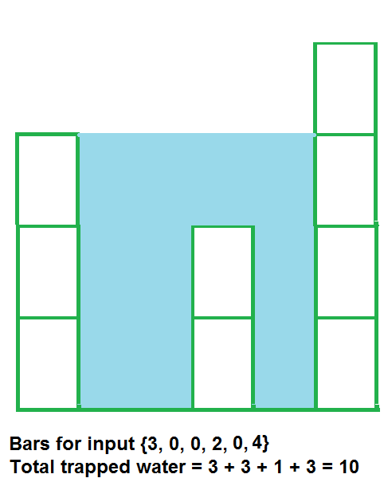

# Save Water

Mani decided to collect rain water to save water and started building a container to trap the water.
But Mani does not have the required material to build a container so she decided to build it using Scrap.

given **N** material of different height and width of each block is 1, compute how much water can be trapped between the blocks when arranged horizontaly during the rainy season.

### Example 1

**Input:**
N = 6
arr[] = {3,0,0,2,0,4}
**Output:**
10
**Explanation:**

### Example 2

**Input:**
N = 4
arr[] = {7,4,0,9}
**Output:**
10
**Explanation:**
Water trapped by above
block of height 4 is 3 units and above
block of height 0 is 7 units. So, the
total unit of water trapped is 10 units.

### Example 3

**Input:**
N = 3
arr[] = {6,9,9}
**Output:**
0
**Explanation:**
No water will be trapped.

### Input Format

- The first Line Contains a single integer T - The number of test case. Then the test case follow.
- Second Line contains number of material N
- Thirst line contains space seprated Integer coontaining height of the block

### Output Format

for each test case print the Volume of water that can be stored between the blocks.

### Constraints

3 $\le$ N $\le$ 106
0 $\le$ Ai $\le$ 108

**Expected Time Complexity:** O(N)
